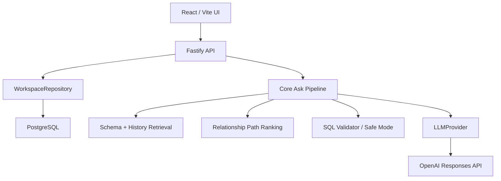

# ASK DATABASE

**Teach it your schema. Ask for data. Get SQL.**

ASK DATABASE is an open-source, schema-aware workspace for database-specific SQL generation. It combines DDL import, historical SELECT memory, business glossary terms, schema aliases, relationship ranking, a backend OpenAI provider boundary and Safe Mode SQL verification.

[Polska wersja](README.md)

Static demo: [https://milekv.github.io/ask-database/](https://milekv.github.io/ask-database/)

## What It Does

ASK DATABASE is not a keyword-to-SQL demo. The production `/api/ask` pipeline:

1. loads a persisted workspace from PostgreSQL,
2. retrieves relevant tables, columns, glossary terms and aliases,
3. retrieves historical SELECT examples as evidence,
4. ranks candidate relationship paths,
5. asks the backend OpenAI provider for a structured interpretation,
6. generates SQL as a Structured Output,
7. validates tables, aliases, columns and Safe Mode,
8. may run up to two controlled regeneration attempts after validation errors,
9. stores a query version and returns evidence plus a decision log.

## Highlights

- User-created workspaces with dialect, DDL and optional historical SQL.
- PostgreSQL persistence through Fastify services and Drizzle migrations.
- Historical SQL memory with literal redaction and structural analysis.
- Business glossary and aliases influencing retrieval.
- Deterministic relationship path ranking.
- Backend-only OpenAI key handling.
- Responses API with Structured Outputs and Zod validation.
- Honest GitHub Pages static demo with saved examples only.

## Three Knowledge Layers

### Schema Memory

Schema Memory is created from DDL. ASK DATABASE persists tables, columns, primary keys, foreign keys and relationships in PostgreSQL. Retrieval does not automatically send the entire schema to the provider; it first selects candidate objects with application-calculated evidence.

### Query Memory

Query Memory is created from historical SELECTs. Import redacts literals and stores normalized SQL, tables, columns, joins, filters, `GROUP BY`, `ORDER BY` and query structure. The most relevant sanitized examples enter SQL generation context.

### Correction Memory

Correction Memory is stored as workspace rules created from user corrections or API input. Enabled workspace rules can influence retrieval and relationship path ranking. The UI for approving memory is still limited, so advanced memory management is best exercised through the API.

## Local Setup

```bash
pnpm install
docker compose up -d
pnpm db:migrate
pnpm dev:api
pnpm dev
```

Web:

```text
http://127.0.0.1:5174/
```

API:

```text
http://127.0.0.1:4310/api/health
```

## OpenAI Configuration

Provider secrets stay on the backend:

```env
LLM_PROVIDER=openai
OPENAI_API_KEY=<backend-openai-api-key>
OPENAI_MODEL=gpt-4.1-mini
OPENAI_TIMEOUT_MS=45000
```

The frontend never reads or sends `OPENAI_API_KEY`.

## Static GitHub Pages Demo

GitHub Pages cannot host Fastify or PostgreSQL. The public deployment therefore shows University Demo schema, relationships, query memory, glossary and explicitly labeled saved examples. It does not pretend that arbitrary live SQL generation is available.

## Architecture



```text
apps/web                 React, Vite, Tailwind, Monaco, React Flow
apps/api                 Fastify, Drizzle, migrations, provider factory
packages/shared          types, Zod schemas, SQL helpers
packages/schema-parser   DDL parser
packages/sql-memory      historical SELECT import and analysis
packages/sql-validator   Safe Mode and schema validation
packages/core            retrieval, prompts, ask pipeline, demo data
packages/ui              shared React components
```

## Commands

```bash
pnpm install
pnpm db:migrate
pnpm lint
pnpm typecheck
pnpm test
pnpm build
pnpm audit
```

## Current Limitations

- Live generation requires the backend, PostgreSQL and `OPENAI_API_KEY`.
- GitHub Pages is static and does not generate arbitrary SQL.
- The UI has basic workspace creation; full step-by-step onboarding, SQL diff, version history UI and manual override need more work.
- The full Test Commerce browser acceptance flow is not complete without a configured provider and manual override UI.

## License

MIT. See [LICENSE](LICENSE).
