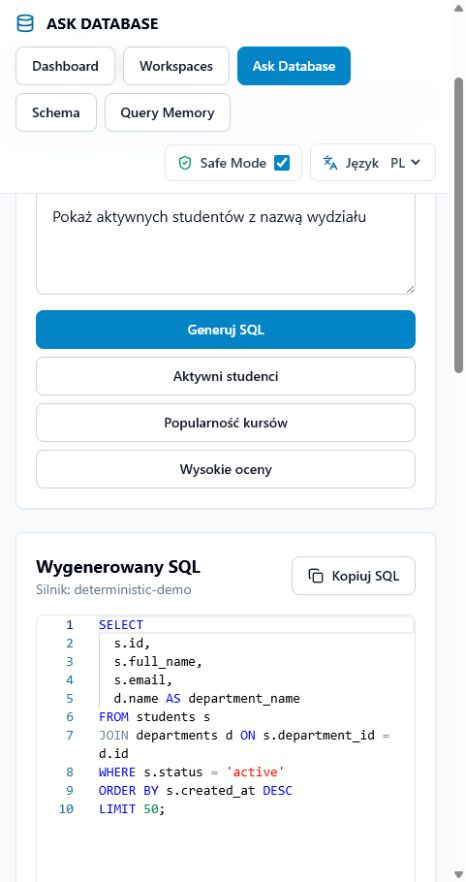

# ASK DATABASE

**Teach it your schema. Ask for data. Get SQL.**

ASK DATABASE is an open-source, schema-aware workspace for database-specific SQL generation. It combines schema memory, historical query memory, business terminology, correction memory and Safe Mode validation.

[Polska wersja](README.md)

Public demo after GitHub Actions deployment: [https://milekv.github.io/ask-database/](https://milekv.github.io/ask-database/)

## Product Preview



## What Makes ASK DATABASE Different?

ASK DATABASE is not just a natural-language-to-SQL screen. Each workspace stores visible, user-controlled knowledge:

- schema and relationships,
- historical SELECT patterns,
- business glossary,
- corrections,
- relationship rules,
- Safe Mode constraints,
- evidence for generated SQL.

## v0.1.0 Features

- TypeScript monorepo with pnpm workspaces.
- Polish-first UI with an EN/PL switch.
- React, Vite, Tailwind, Monaco Editor and React Flow.
- Fastify API boundary.
- Deterministic University Demo workspace.
- DDL parser for representative table and foreign key syntax.
- Historical SELECT import and literal redaction.
- Query pattern learning.
- Business Glossary, Relationship Rules, Workspace Memory and Correction Memory.
- Safe Mode for read-only SQL.
- Schema validation for tables and qualified columns.
- PostgreSQL Docker Compose for local development.

## Local Setup

```bash
pnpm install
pnpm build
pnpm test
pnpm dev
```

Web app:

```text
http://127.0.0.1:5174/
```

API:

```bash
pnpm dev:api
```

```text
http://127.0.0.1:4310/api/health
```

## Architecture

```text
apps/web                 React application
apps/api                 Fastify API
packages/shared          types, Zod schemas and SQL utilities
packages/schema-parser   DDL parsing
packages/sql-memory      historical SELECT analysis
packages/sql-validator   Safe Mode and schema validation
packages/core            workspace pipeline and demo data
packages/ui              shared React components
```

## Privacy Model

The browser never stores provider keys. The default LLM provider is disabled. ASK DATABASE v0.1.0 generates read-only SQL and validates the result before showing it.

## License

MIT.
