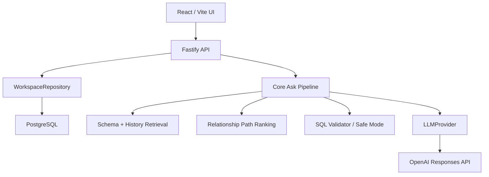

# ASK DATABASE

**Naucz system swojej bazy. Powiedz, jakich danych potrzebujesz. Otrzymaj SQL.**

ASK DATABASE to polski, open-source'owy workspace do pracy z własnym schematem bazy danych. Produkt łączy import DDL, pamięć historycznych SELECT-ów, słownik biznesowy, aliasy, ranking relacji, provider OpenAI po stronie backendu oraz walidację Safe Mode przed pokazaniem SQL.

[English version](README.en.md)

Demo statyczne: [https://milekv.github.io/ask-database/](https://milekv.github.io/ask-database/)


## Co robi projekt

ASK DATABASE nie jest prostą mapą słów kluczowych na gotowy SQL. Produkcyjny endpoint `/api/ask` używa asynchronicznego pipeline'u:

1. ładuje zapisany workspace z PostgreSQL,
2. pobiera pasujące tabele, kolumny, glossary i aliasy,
3. wybiera historyczne SELECT-y jako evidence,
4. rankinguje ścieżki relacji,
5. prosi backendowy provider OpenAI o strukturalną interpretację pytania,
6. generuje SQL jako Structured Output,
7. waliduje tabele, aliasy, kolumny i Safe Mode,
8. przy błędach może wykonać maksymalnie dwie kontrolowane regeneracje,
9. zapisuje wersję zapytania i zwraca evidence oraz decision log.

## Co wyróżnia ASK DATABASE

- **Workspace per baza**: użytkownik może utworzyć własny workspace, wybrać dialekt i wkleić DDL.
- **PostgreSQL persistence**: workspace, schemat, relacje, glossary, aliasy, pamięć i historia rozmów są zapisywane w bazie.
- **Query Memory**: historyczne SELECT-y są redagowane i analizowane strukturalnie.
- **Business Glossary i aliasy**: język zespołu wpływa na retrieval schematu.
- **Relationship Path Ranking**: joiny są wybierane przez deterministyczny ranking relacji.
- **OpenAI Provider Boundary**: klucz API istnieje wyłącznie po stronie backendu.
- **Structured Outputs + Zod**: odpowiedzi providera są walidowane typami.
- **Safe Mode**: wynik musi być `SELECT` albo `WITH`; destrukcyjne polecenia są blokowane.
- **Statyczne GitHub Pages bez udawania backendu**: publiczna strona pokazuje zapisany przykład demo i jasno mówi, że live generowanie wymaga lokalnego API.

## Trzy warstwy wiedzy

### Schema Memory

Schema Memory powstaje z DDL. ASK DATABASE zapisuje tabele, kolumny, primary keys, foreign keys i relacje w PostgreSQL. Retrieval nie wysyła automatycznie całego schematu do providera; najpierw wybiera kandydatów i evidence aplikacyjne.

### Query Memory

Query Memory powstaje z historycznych SELECT-ów. Import usuwa literały, zapisuje znormalizowany SQL, tabele, kolumny, joiny, filtry, `GROUP BY`, `ORDER BY` i strukturę zapytania. Najtrafniejsze historyczne przykłady trafiają do promptu generowania jako sanitized SQL.

### Correction Memory

Correction Memory to reguły zapisane po korektach użytkownika albo dodane ręcznie przez API. Aktywne reguły workspace mogą wpływać na retrieval i ranking ścieżek relacji. UI ma jeszcze ograniczony ekran zatwierdzania pamięci, więc zaawansowane zarządzanie pamięcią najlepiej testować przez API.

## Tryby działania

### Lokalnie z backendem

Pełny tryb produktu wymaga PostgreSQL, migracji API i skonfigurowanego providera.

```bash
pnpm install
docker compose up -d
pnpm db:migrate
pnpm dev:api
pnpm dev
```

Web:

```text
http://127.0.0.1:5174/
```

API:

```text
http://127.0.0.1:4310/api/health
```

### GitHub Pages

GitHub Pages nie hostuje Fastify ani PostgreSQL. Dlatego publiczna strona działa jako statyczne demo:

- pokazuje University Demo,
- pokazuje schemat, relacje, historyczne SELECT-y i glossary,
- może pokazać jawnie oznaczony zapisany przykład,
- nie udaje live generowania dla dowolnego pytania.

## Konfiguracja OpenAI

Klucz providera ustawiaj tylko w backendzie:

```env
LLM_PROVIDER=openai
OPENAI_API_KEY=<backend-openai-api-key>
OPENAI_MODEL=gpt-4.1-mini
OPENAI_TIMEOUT_MS=45000
```

Frontend nie czyta i nie wysyła `OPENAI_API_KEY`.

## Zmienne środowiskowe

Skopiuj `.env.example` do `.env`.

Najważniejsze wartości:

- `DATABASE_URL`
- `API_HOST`
- `API_PORT`
- `LLM_PROVIDER`
- `OPENAI_API_KEY`
- `OPENAI_MODEL`
- `OPENAI_TIMEOUT_MS`

## API

Workspace:

- `GET /api/workspaces`
- `POST /api/workspaces`
- `GET /api/workspaces/:workspaceId`
- `PATCH /api/workspaces/:workspaceId`
- `DELETE /api/workspaces/:workspaceId`

Ask Database:

- `POST /api/workspaces/:workspaceId/ask`
- `POST /api/ask`
- `POST /api/workspaces/:workspaceId/conversations/:conversationId/corrections`

Wiedza workspace:

- `POST /api/workspaces/:workspaceId/glossary`
- `PATCH /api/workspaces/:workspaceId/glossary/:termId`
- `DELETE /api/workspaces/:workspaceId/glossary/:termId`
- `POST /api/workspaces/:workspaceId/aliases`
- `PATCH /api/workspaces/:workspaceId/aliases/:aliasId`
- `DELETE /api/workspaces/:workspaceId/aliases/:aliasId`
- `POST /api/workspaces/:workspaceId/memory`
- `PATCH /api/workspaces/:workspaceId/memory/:memoryId`
- `DELETE /api/workspaces/:workspaceId/memory/:memoryId`

## Architektura



```text
apps/web                 React, Vite, Tailwind, Monaco, React Flow
apps/api                 Fastify, Drizzle, migrations, provider factory
packages/shared          typy, Zod schemas, SQL helpers
packages/schema-parser   parser DDL
packages/sql-memory      import i analiza historycznych SELECT-ów
packages/sql-validator   Safe Mode i walidacja schematu
packages/core            retrieval, prompts, ask pipeline, demo data
packages/ui              współdzielone komponenty React
```

## Przykład University Demo

Pytanie:

```text
Pokaż studentów przyjętych od 2022 roku, którzy są obecnie aktywni i uzyskali co najmniej jedną ocenę 5. Posortuj ich według nazwiska.
```

Pipeline pobiera między innymi:

- glossary: `aktywni studenci`, `wysokie oceny`,
- kandydatów schematu: `students`, `enrollments`, `grades`,
- relacje: `students -> enrollments -> grades`,
- historyczne SELECT-y z podobnymi tabelami i filtrami.

Przykład korekty:

```text
Oceny pobieraj przez zapisy na kurs, nie bezpośrednio ze studenta.
```

Backendowy endpoint korekty interpretuje poprawkę, regeneruje SQL przez ten sam pipeline i może zaproponować zapis do Workspace Memory. Trwałe zapisywanie pamięci działa przez API; pełny interfejs zatwierdzania tej pamięci w UI jest nadal ograniczony.

## Komendy

```bash
pnpm install
pnpm db:migrate
pnpm lint
pnpm typecheck
pnpm test
pnpm build
pnpm audit
```

## Testy

Testy obejmują parser DDL, import historycznych SELECT-ów, redakcję literałów, walidację Safe Mode, retrieval, ranking relacji i orkiestrację pipeline'u z `MockLLMProvider`.

## Aktualne ograniczenia

- Live generowanie wymaga backendu, PostgreSQL i `OPENAI_API_KEY`.
- GitHub Pages jest statyczne i nie generuje dowolnego SQL.
- UI ma podstawowe tworzenie workspace; pełny kreator krok po kroku, wersjonowanie rozmów w UI, SQL diff i manual override są jeszcze do rozbudowy.
- Test Commerce acceptance flow nie jest kompletny bez skonfigurowanego providera OpenAI i brakujących elementów manual override w UI.

## Licencja

MIT. Szczegóły w pliku [LICENSE](LICENSE).
