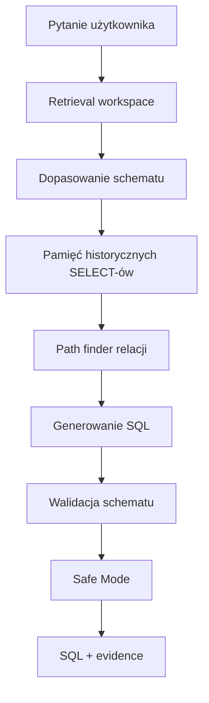

# ASK DATABASE

**Naucz system swojej bazy. Powiedz, jakich danych potrzebujesz. Otrzymaj SQL.**

ASK DATABASE to profesjonalny, open-source'owy workspace do pracy z konkretną bazą danych: schematem, relacjami, historycznymi SELECT-ami, terminologią biznesową, korektami i regułami bezpieczeństwa. Celem projektu nie jest pokazanie “magicznego czatu”, tylko zbudowanie widocznej warstwy wiedzy, która pomaga generować i weryfikować zapytania SQL w sposób kontrolowany.

[English version](README.en.md)

Demo publiczne po przejściu GitHub Actions: [https://milekv.github.io/ask-database/](https://milekv.github.io/ask-database/)


## Podgląd produktu


## Dlaczego istnieje ASK DATABASE

Natural-language-to-SQL bez kontekstu bazy jest kruche. Ten sam termin biznesowy może oznaczać inną tabelę, inny join albo inny filtr w zależności od firmy i workspace. ASK DATABASE rozwiązuje ten problem przez jawne uczenie systemu:

- jakie tabele i kolumny istnieją,
- które relacje są poprawne,
- jak zespół wcześniej pisał SELECT-y,
- jakie terminy biznesowe oznaczają konkretne warunki SQL,
- jakie korekty użytkownik zatwierdził wcześniej,
- jakie reguły Safe Mode muszą być spełnione przed pokazaniem wyniku.

## Co wyróżnia ASK DATABASE

ASK DATABASE nie jest tylko ekranem “zadaj pytanie, dostaniesz SQL”.

Najważniejsze różnice:

- **Schema Memory**: każda przestrzeń robocza ma własny schemat i wersję wiedzy.
- **Historical Query Memory**: system analizuje stare SELECT-y i wykrywa wzorce joinów, filtrów i agregacji.
- **Correction Memory**: poprawki użytkownika stają się częścią pamięci workspace.
- **Business Glossary**: język zespołu jest mapowany na tabele, kolumny i warunki SQL.
- **Evidence**: wynik pokazuje, z czego został zbudowany.
- **Safe Mode**: wersja 0.1.0 generuje tylko read-only SQL i waliduje rezultat.
- **Brak sekretów w przeglądarce**: provider LLM może być obsługiwany tylko przez backend.

## Jak działa pipeline



## Funkcje v0.1.0

- Monorepo TypeScript z `pnpm workspaces`.
- Polski interfejs jako domyślny.
- Widoczny przełącznik PL/EN.
- Demo workspace “University Demo”.
- Parser DDL dla reprezentatywnego `CREATE TABLE` i `ALTER TABLE ... FOREIGN KEY`.
- Query Memory z redakcją literałów.
- Wykrywanie tabel, joinów, filtrów, `GROUP BY` i `ORDER BY` w historycznych SELECT-ach.
- Deterministyczne wzorce zapytań.
- Business Glossary.
- Relationship Rules.
- Workspace Memory i Correction Memory.
- Safe Mode blokujący zapytania inne niż `SELECT`/`WITH`.
- Walidacja tabel i kwalifikowanych kolumn względem schematu.
- Evidence i confidence dla wygenerowanego wyniku.
- API Fastify z `/api/health`, `/api/workspaces/demo`, `/api/ask`.
- Frontend React + Vite + Tailwind + Monaco Editor + React Flow.
- Docker Compose z PostgreSQL do lokalnej persistencji.

## Przykład z University Demo

Pytanie:

```text
Pokaż aktywnych studentów z nazwą wydziału
```

Interpretacja:

```text
Aktywni studenci wraz z nazwą wydziału, ograniczeni limitem wyników.
```

Wynik:

```sql
SELECT
  s.id,
  s.full_name,
  s.email,
  d.name AS department_name
FROM students s
JOIN departments d ON s.department_id = d.id
WHERE s.status = 'active'
ORDER BY s.created_at DESC
LIMIT 50;
```

Evidence:

- schemat zawiera tabele `students` i `departments`,
- relacja `students.department_id -> departments.id` pochodzi z DDL,
- glossary zna termin “aktywni studenci”,
- Safe Mode potwierdza read-only SQL.

## Architektura

```text
ask-database/
  apps/
    web/                  # React, Vite, Tailwind, Monaco, React Flow
    api/                  # Fastify API i provider boundary
  packages/
    shared/               # typy, schematy Zod, wspólne utilsy SQL
    schema-parser/        # parser DDL
    sql-memory/           # import i analiza historycznych SELECT-ów
    sql-validator/        # Safe Mode i walidacja schematu
    core/                 # pipeline, demo workspace, health score, path finder
    ui/                   # współdzielone komponenty React
  examples/university-demo/
  docs/
  public-assets/
```

## Model prywatności

- ASK DATABASE v0.1.0 nie wykonuje zapytań na produkcyjnej bazie.
- Frontend nie przechowuje kluczy providerów.
- Historyczne SQL-e są redagowane przez zastąpienie literałów.
- Provider LLM jest abstrakcją backendową i domyślnie jest wyłączony.
- Safe Mode dopuszcza tylko zapytania odczytujące dane.

## Instalacja lokalna

Wymagania:

- Node.js 22+
- pnpm 11+
- opcjonalnie Docker, jeśli chcesz uruchomić PostgreSQL

```bash
pnpm install
pnpm build
pnpm test
pnpm dev
```

Aplikacja webowa uruchamia się lokalnie na:

```text
http://127.0.0.1:5174/
```

API:

```bash
pnpm dev:api
```

Domyślny adres API:

```text
http://127.0.0.1:4310/api/health
```

## Docker

```bash
docker compose up -d
```

`docker-compose.yml` uruchamia lokalnego PostgreSQL-a dla dalszego rozwoju persistencji.

## Zmienne środowiskowe

Skopiuj `.env.example` do `.env` w lokalnym środowisku. Plik `.env` jest ignorowany przez Git.

Najważniejsze zmienne:

- `DATABASE_URL`
- `API_HOST`
- `API_PORT`
- `LLM_PROVIDER`
- `LLM_API_KEY`

## Komendy deweloperskie

```bash
pnpm dev          # frontend
pnpm dev:api      # API
pnpm build        # build całego monorepo
pnpm test         # build + testy pakietów
pnpm typecheck    # strict TypeScript
pnpm lint:repo    # skan publicznej higieny repo
```

## Testy

Testy obejmują:

- parser DDL,
- import historycznych SELECT-ów,
- redakcję literałów,
- ekstrakcję tabel, joinów, filtrów i sortowania,
- Safe Mode,
- walidację tabel i kolumn,
- workspace health,
- path finder relacji,
- deterministyczny pipeline generowania SQL.

## Roadmap

- Trwała persistencja workspace w PostgreSQL.
- Pełny kreator importu schematu z zapisem postępu.
- Adaptery providerów LLM za backendem.
- Rozbudowany retrieval semantyczny.
- Porównanie dialektów SQL.
- Eksport raportów i wersjonowanie historii zapytań.
- GitHub Pages tylko dla uczciwego statycznego demo bez udawania live providera.

## Contributing

Projekt jest pisany z myślą o publicznym open-source. Pull requesty powinny mieć:

- przejrzysty zakres,
- testy dla logiki core/parser/memory/validator,
- brak danych prywatnych,
- brak kluczy i lokalnych ścieżek,
- UI copy przez i18n.

## Licencja

MIT. Szczegóły w pliku [LICENSE](LICENSE).
