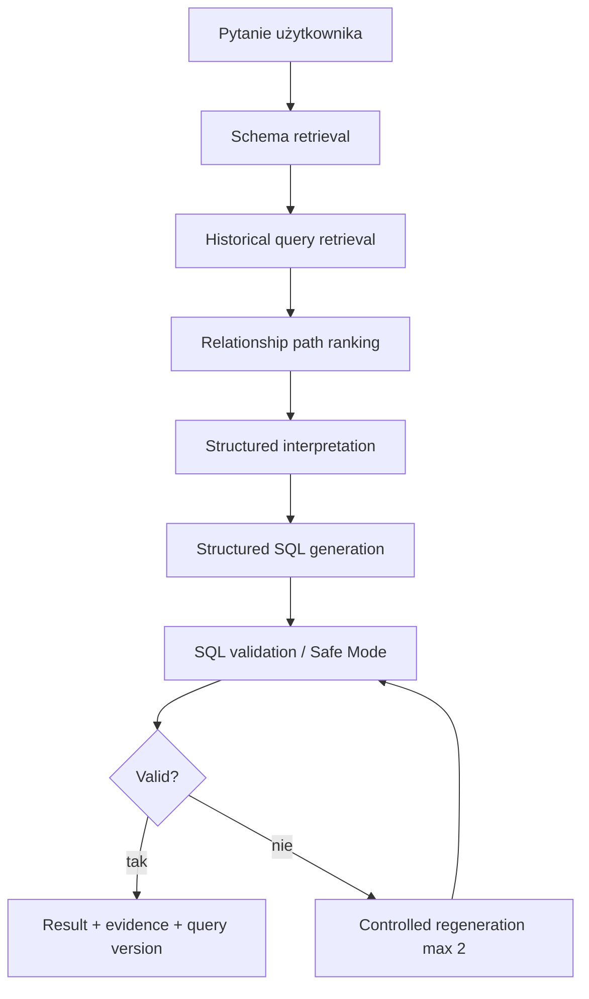

# Architektura ASK DATABASE

ASK DATABASE składa się z aplikacji webowej, API i pakietów domenowych. UI pokazuje stan produktu, ale core logic, parsery, retrieval i walidacja są w pakietach testowalnych poza Reactem.

## Warstwy

- `apps/web`: React, Vite, Tailwind, Monaco Editor, React Flow, statyczny tryb GitHub Pages.
- `apps/api`: Fastify API, Drizzle, migracje, repozytoria, serwisy i provider factory.
- `packages/shared`: typy, schematy Zod i wspólne utilsy SQL.
- `packages/schema-parser`: parser DDL.
- `packages/sql-memory`: import i analiza historycznych SELECT-ów.
- `packages/sql-validator`: Safe Mode i walidacja schematu.
- `packages/core`: prompt modules, retrieval, relationship path ranking i ask pipeline.
- `packages/ui`: współdzielone komponenty React.

## Pipeline

## Zasada bezpieczeństwa

Provider działa wyłącznie po stronie backendu. Frontend nie zna `OPENAI_API_KEY`, nie przechowuje sekretów i w statycznym trybie nie udaje live generowania.
